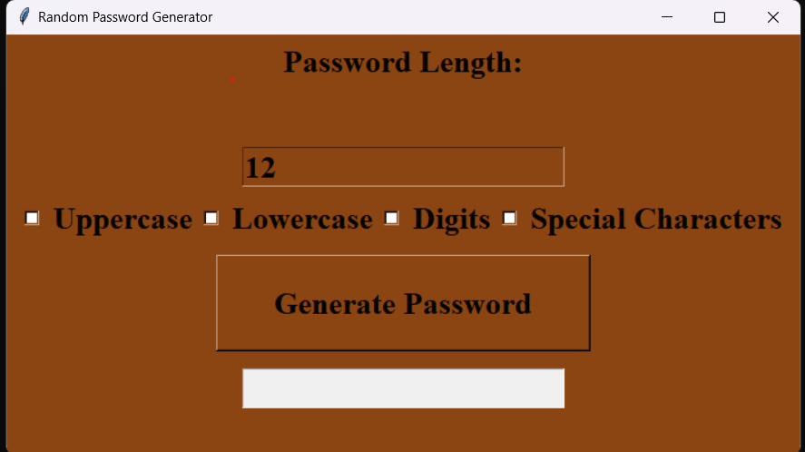

# Random Password Generator



A simple Python application with a graphical user interface (GUI) for generating random passwords. You can customize the length and character types (uppercase, lowercase, digits, and special characters) to create secure and unique passwords.

## Table of Contents

- [Features](#features)
- [Requirements](#requirements)
- [Installation](#installation)
- [Usage](#usage)
- [Contributing](#contributing)


## Features

- **User-Friendly Interface:** The application features an easy-to-use GUI built with Tkinter, making it simple to generate random passwords.

- **Customizable Length:** You can specify the length of the password you want to generate, allowing you to create passwords of different lengths.

- **Character Type Selection:** Customize the password generation by selecting which character types to include: uppercase letters, lowercase letters, digits, and special characters.

- **Secure Passwords:** The application generates secure passwords by using random characters from the selected character types.

## Requirements

- Python 3.x
- Tkinter (usually included with Python)

## Installation

1. Clone the repository to your local machine using:

   ```bash
   git clone https://github.com/yourusername/Random-Password-Generator.git
   ```

2. Change directory to the project folder:

   ```bash
   cd Random-Password-Generator
   ```

3. Run the application:

   ```bash
   python main.py
   ```

## Usage

1. Launch the application using the installation instructions above.

2. Specify the desired password length in the "Password Length" input field. The default length is 12 characters.

3. Select the character types you want to include in the generated password by checking the corresponding checkboxes: Uppercase, Lowercase, Digits, and Special Characters.

4. Click the "Generate Password" button to create a random password based on your preferences.

5. The generated password will be displayed in the "Password Result" field, and you can easily copy and use it.

6. You can generate new passwords by changing the options and clicking the button again.

## Contributing

Contributions are welcome! If you have any suggestions, feature requests, or find any issues, please feel free to open an issue or create a pull request.


Create secure and random passwords effortlessly! 🔐
